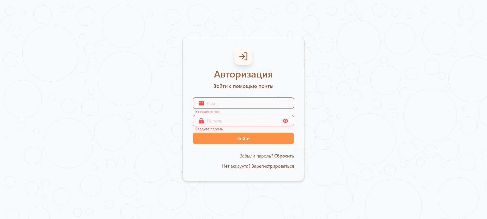
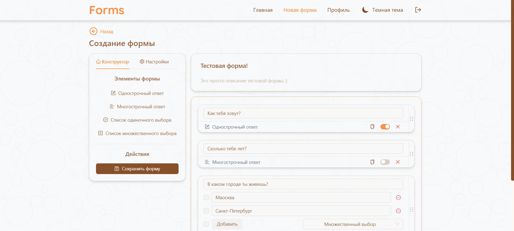
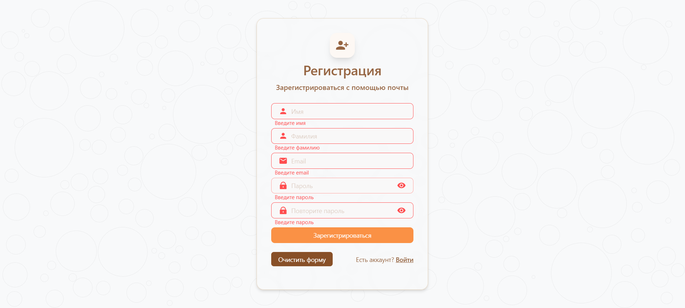
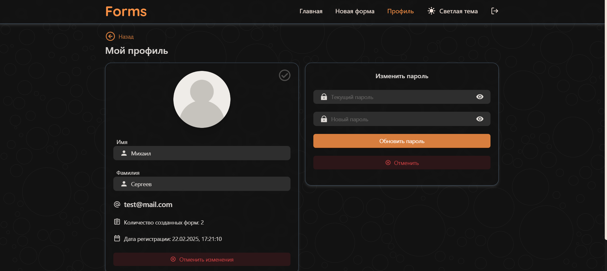

# 📝 Forms: Платформа для создания опросов и анкет 📊

Добро пожаловать в **Forms** — удобный инструмент для создания форм, проведения опросов, сбора обратной связи, приема заявок и многого другого! 🚀

- 🔗 [Ссылка на проект](https://andrey999k.github.io/Forms/)

## 📖 О проекте

**Forms** — это современная платформа для создания и управления формами. Мы разработали удобный интерфейс, который позволяет быстро настраивать формы с множеством параметров и анализировать полученные ответы.

## 🚀 Функционал

- 🔍 Создание форм: Легко создавайте кастомизированные формы для опросов и заявок.
- 📊 Аналитика откликов: Просматривайте и анализируйте собранные ответы.
- 👤 Аутентификация: Регистрация и вход в систему для сохранения форм.
- 🌗 Темная и светлая темы: Переключение темы для удобного использования.
- 📱 Адаптивный дизайн: Поддержка работы на ПК, планшетах и смартфонах.

## 📷 Скриншоты






## 🛠 Технологии

- **Frontend**:

  - React + TypeScript
  - Ant Design
  - Tailwind CSS
  - Redux Toolkit, Redux Toolkit Query, Axios
  - React Router Dom 6

- **Backend**:

  - Firebase (аутентификация и хранение данных)

- **Тестирование**:

  - Vitest, React Testing Library

- **DevOps**:
  - Vite
  - Eslint и Husky
  - GitHub Actions

## 💻 Установка и запуск

## 📌 Предварительные требования:

- Node.js >= 14.x
- Git

### 🚀 Шаги установки:

1. Склонируйте репозиторий

   ```bash
   git clone https://github.com/andrey999k/Forms.git
   cd Forms

   ```

2. Установите зависимости

   ```bash
   npm install

   ```

3. Создайте файл .env и укажите переменные:

```bash
VITE_FIREBASE_API_KEY="your_firebase_api_key"
VITE_FIREBASE_AUTH_DOMAIN="your_firebase_auth_domain"
VITE_FIREBASE_PROJECT_ID="your_firebase_project_id"
VITE_FIREBASE_STORAGE_BUCKET="your_firebase_storage_bucket"
VITE_FIREBASE_MESSAGING_SENDER_ID="your_firebase_messaging_sender_id"
VITE_FIREBASE_APP_ID="your_firebase_app_id"
VITE_FIREBASE_DATABASE_URL="your_firebase_database_url"
VITE_FIREBASE_CONFIG_ENDPOINT="your_firebase_config_endpoint"
VITE_CLOUDINARY_BASE_URL="your_cloudinary_base_url"
VITE_CLOUDINARY_UPLOAD_PRESET="your_cloudinary_upload_preset"
```

4. **Запустите проект**

```bash
npm run dev
```

Откройте приложение в браузере

Перейдите по адресу: http://localhost:5173/

## 🤝 Содействие

Хотите помочь проекту? Отлично! Следуйте этим шагам:

- Форкните репозиторий.
- Создайте ветку (feature/your-feature).
- Закоммитьте изменения (git commit -m 'Добавлена новая функция').
- Запушьте ветку (git push origin feature/your-feature).
- Откройте Pull Request.

## 📞 Контакты

# 💬 Telegram: [@Andrey_Kutuzovv](https://t.me/Andrey_Kutuzovv)
# 📧 Email: alexeywest024@list.ru

Спасибо, что посетили Forms! Мы надеемся, что вам понравится наш проект так же, как и нам понравилось его создавать! 🌟
